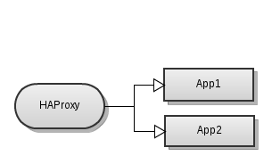
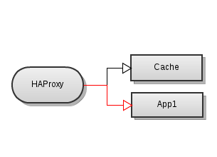

!SLIDE 
## HAProxy - Load Balancer

**Scalability + Availability**
 
  * proxying (tcp, http)
  * load balancing
  * routing
  

!SLIDE
## HAProxy - Proxying

    frontend http-in
      bind *:80
      use_backend app

    backend app
      server app localhost:3000

!SLIDE smbullets incremental
## HAProxy - Load Balancing Algorithms

  * roundrobin
  * source - ip address
  * url_param - query param /todos?user=123
  * uri - /users/123
  * cookie

!SLIDE
## HAProxy - Load Balancing

    backend app
      balance roundrobin
      server app1 127.0.0.1:3001
      server app2 127.0.0.1:3002

!SLIDE smbullets incremental
## HAProxy - Health Checking

  * inter: time between checks 
  * fall: n failures till down'd
  * rise: n successes till up'd
  * backup: for emergency
  * httpchk: http request for health check

!SLIDE small
## HAProxy - Health Checking

    backend cache
      option httpchk GET /health-check

      server cache 127.0.0.1:4000 check inter 5s fall 1 rise 2
      server app1  127.0.0.1:3001 check inter 5s fall 1 rise 2 backup

!SLIDE
## HAProxy - Routing

Use caching layer for all javascript files

    frontend http-in
      bind *:80
      acl is_cache url_beg /javascripts/
      use_backend cache if is_cache
      default_backend app
