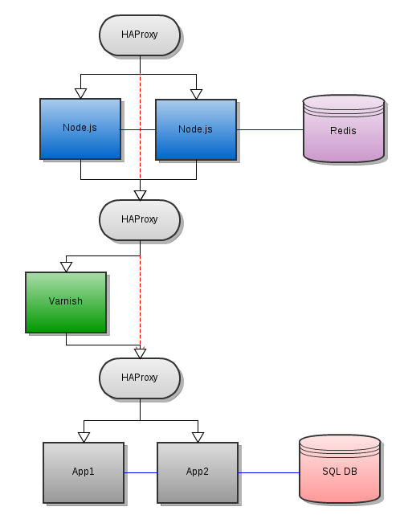

!SLIDE 

!SLIDE 
## Performance

<table>
  <tr>
    <th></th>
    <th>Concurrency</th>
    <th>Throughput</th>
    <th>Response time</th>
  </tr>
  <tr>
    <td>Rails App</td>
    <td>13</td>
    <td>20req/sec</td>
    <td>220ms</td>
  </tr>
  <tr>
    <td>Varnish</td>
    <td>170</td>
    <td>1500req/sec</td>
    <td>100ms</td>
  </tr>
  <tr>
    <td>Node.js</td>
    <td>55</td>
    <td>600req/sec</td>
    <td>90ms</td>
  </tr>
  <tr>
    <td>HAProxy to Node</td>
    <td>75</td>
    <td>650req/sec</td>
    <td>120ms</td>
  </tr>
</table>

*Note: HAProxy + Node.js out performs just Node.js*

!SLIDE small smbullets
## References

  * haproxy - http://haproxy.1wt.eu/ 
  * varnish - http://www.varnish-cache.org/docs
  * node.js - http://nodejs.org/
  * redis - http://redis.io/

https://github.com/jeffsu/scalability-tutorial

http://github.com/jeffsu/hook

http://github.com/jeffsu/mochiscript
 
