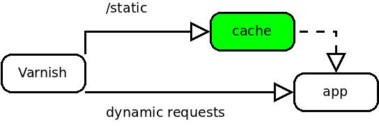

!SLIDE smbullets
## Varnish - Caching Proxy

**Don't Repeat Yourself**

  * HTTP Caching
  * expressive C-like configuration
  * very very very fast

!SLIDE
## Varnish - Proxy

    backend app {
      .host = "127.0.0.1";
      .port = "3000";
    }

    sub vcl_recv {
      return(pass);
    }

!SLIDE small
## Varnish - Smarter config

    sub vcl_recv {
      if (req.url ~ "^/static") {
        unset req.http.cookie;
        return(lookup);
      }

      return(pass);
    }

!SLIDE 
## Varnish - Fetch Example

After backend has been fetched

    sub vcl_fetch {
      if (beresp.status < 300) {
        unset beresp.http.set-cookie;
        set beresp.ttl = 20m;
        return(deliver);
      }
    }

!SLIDE
## Varnish - Semi Dynamic

    sub vcl_fetch {
      if (beresp.status < 300) {
        if (req.url ~ "^/static") {
          unset beresp.http.set-cookie;
          set beresp.ttl = 20m;
          return(deliver);
        } else {
          set beresp.ttl = 1s;
          return(deliver);
        }
      }
    }

!SLIDE smbullets
## Varnish - Other Features

  * graceful caching
  * ESI: Edge Side Includes
  * load balancing/health checking

!SLIDE

